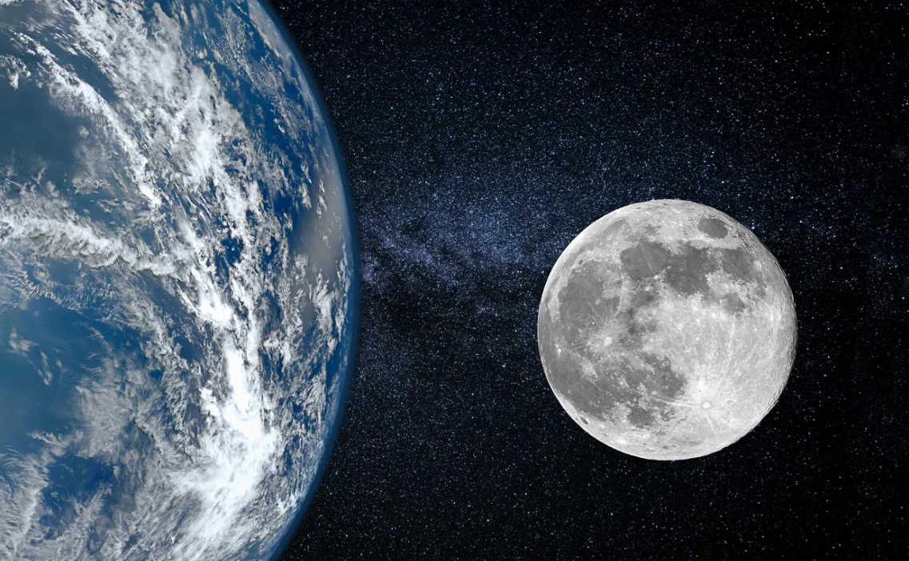
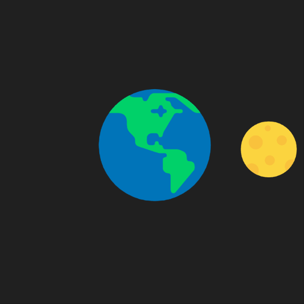

# Quiz 8

## Part 1 - Imaging Technique Inspiration

>I was inspired by an article in [*Parade*](https://www.google.https://parade.com/651086/marilynvossavant/moons-rotation/) magazine that discusses the **Moon's rotation** and its effect on the **Earth**. The fact that the Moon exhibits synchronous rotation, meaning that it rotates on its axis once per orbit around the Earth and always presents the same side to us, is a unique phenomenon that I wanted to express and include in my coding assignment.

#### Aspect to Incorporate: 
The concept of synchronous rotation can be visually represented in your project to illustrate the Moon's consistent orientation towards Earth.

#### Images to Illustrate:
###### Diagram Synchronous Rotation:
  
 - A visual representation showing the Moon's rotation and orbit around Earth.


######  Moon's Rotation Animation: 

- An animated sequence demonstrating how the Moon maintains the same face towards Earth.


## Part 2 - Coding Technique Exploration

#### Coding Technique: 
Use HTML and p5.js to create an animation that simulates the moon's orbit and rotation.

#### Implementation: 
By creating an animation with javascript, you can design a rotating moon that always faces the Earth, mimicking a synchronous rotation.

##### Example code:
I got the inspiration from [Happycoding](https://happycoding.io/tutorials/p5js/arrays/earth-moon-emoji-orbit)


```javascript
let earthSize = 150;
let moonSize = 75;
let angle = 0;
let distance = 150;
let moons = ['🌕', '🌖', '🌗', '🌘', '🌑', '🌒', '🌓', '🌔'];
let moonIndex = 0;
let earths = ['🌎', '🌍', '🌏'];
let earthIndex = 0;

function setup() {
  createCanvas(400, 400);
  textAlign(CENTER, CENTER);
}

function draw() {
  background(32); 
  
  angle++; 

  if (angle % 45 == 0) {
    moonIndex++;
    if (moonIndex >= moons.length) {
      moonIndex = 0;
    }
  }

  if (angle % 120 == 0) {
    earthIndex++;
    if (earthIndex >= earths.length) {
      earthIndex = 0;
    }
  }

  let moonX = width / 2 + cos(radians(angle)) * distance;
  let moonY = height / 2 + sin(radians(angle)) * distance;

  textSize(earthSize);
  text(earths[earthIndex], width / 2, height / 2);

  textSize(moonSize);
  text(moons[moonIndex], moonX, moonY);
}
```

##### here is the result gif of the example coding 



