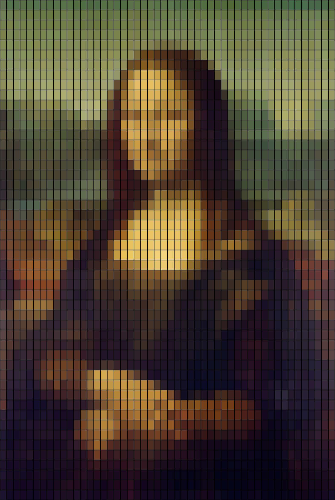

# szha3538_9103_tut3
This is my first push to github

# Header 1
## Header 2
### Header 3
#### Header 4
##### Header 5
###### Header 6

**Bold Text** or __Bold Text__
*Italic Text* or _Italic Text_

- Item 1
- Item 2
  - Subitem 2.1
  - Subitem 2.2

1. First Item
2. Second Item
3. Third Item

[Link Text](https://www.google.com)

``js
function helloworld(){
    for (i = 0; i<10; i++)
    //dosomething
}
// some code in a block
'''

>blockquote

